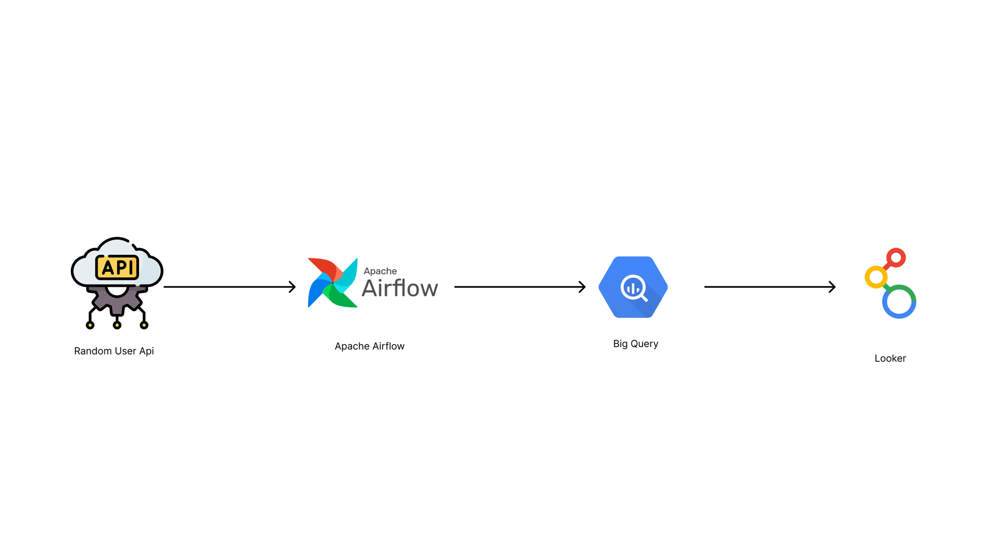

# GCP Data Pipeline — Random User API to Looker

A data engineering pipeline that ingests data from the Random User API, orchestrates it with Apache Airflow, stores and transforms it in BigQuery, and visualizes it in Looker.

## 🏗️ Architecture



**Random User API → Apache Airflow → BigQuery → Looker**

## 🔧 Tech Stack

| Tool | Purpose |
|------|---------|
| [Random User API](https://randomuser.me/) | Source data — generates fake user data |
| [Apache Airflow](https://airflow.apache.org/) | Pipeline orchestration & scheduling |
| [BigQuery](https://cloud.google.com/bigquery) | Cloud data warehouse |
| [Looker](https://cloud.google.com/looker) | Data visualization & dashboards |

## 🔄 Pipeline Flow

1. **Ingest** — Fetch user records from the Random User API
2. **Orchestrate** — Apache Airflow DAGs schedule and manage the pipeline
3. **Store & Transform** — Raw data lands in BigQuery; SQL transforms clean and model it
4. **Visualize** — Looker connects to BigQuery to serve dashboards and reports

## 🚀 Getting Started

### Prerequisites
- Google Cloud Platform account
- Apache Airflow (local or Cloud Composer)
- Python 3.8+

### Setup

1. **Clone the repository**
```bash
   git clone https://github.com/your-username/your-repo.git
   cd your-repo
```

2. **Install dependencies**
```bash
   pip install -r requirements.txt
```

3. **Configure GCP credentials**
```bash
   export GOOGLE_APPLICATION_CREDENTIALS="path/to/your/service-account.json"
```

4. **Set up Airflow**
```bash
   airflow db init
   airflow webserver --port 8080
   airflow scheduler
```

5. **Trigger the DAG**
   - Open Airflow UI at `http://localhost:8080`
   - Enable and trigger the pipeline DAG

## 📁 Project Structure
```
├── dags/
│   └── random_user_pipeline.py   # Airflow DAG definition
├── scripts/
│   └── fetch_users.py            # API ingestion logic
├── sql/
│   └── transform.sql             # BigQuery transformation queries
├── images/
│   └── gcp_data_architecture.png # Architecture diagram
├── requirements.txt
└── README.md
```

## 📊 BigQuery Schema
```sql
CREATE TABLE users.raw_users (
  id        STRING,
  name      STRING,
  email     STRING,
  country   STRING,
  ingested_at TIMESTAMP
);
```

## 🤝 Contributing

Pull requests are welcome! Please open an issue first to discuss any changes.

## 📄 License

This project is licensed under the MIT License.
```

---

**To add the image**, place your `gcp_data_architecture.png` in an `images/` folder in your repo:
```
your-repo/
└── images/
    └── gcp_data_architecture.png
